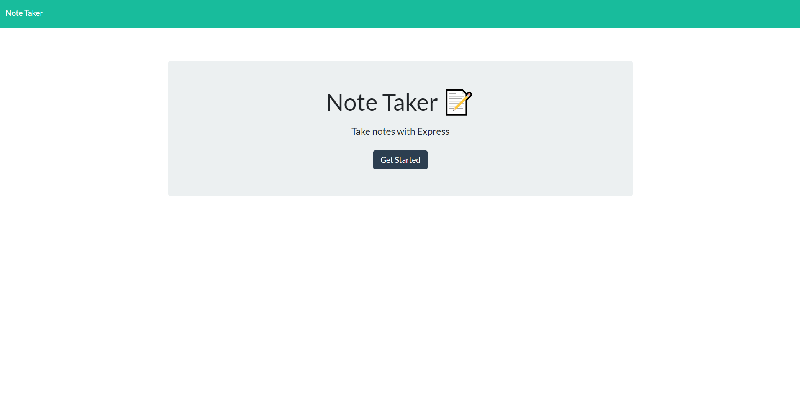

# Note.Taker

[](https://choosealicense.com/licenses/bsd-3-clause/)

## Description

Note Taker application that uses an Express.js back end.

## User Story

```
AS A small business owner
I WANT to be able to write and save notes
SO THAT I can organize my thoughts and keep track of tasks I need to complete
```

## Usage

Initial startup Page:



Empty Notes Page:


Filled Notes Page:

